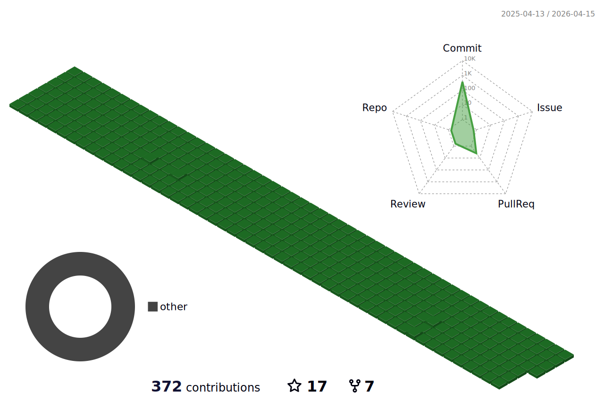

<!-- 

 -->
<h1 align='center'>Hi there, I'm Hung 👋✌🏻</h1>

  <samp>
  Currently, I'm working as frontend developer. You can follow my blog here
    <a href="https://web-totals.vercel.app">Web totals</a>
    ✍️ ✍️ ✍️
  </samp>

<h2 align='center'> 📈 Github Stars </h2>

 
  
  
  

<!--  
   -->
  
  <h2 align='center'> 📈 Contributions in this year </h2>
<!--    -->
  
  

