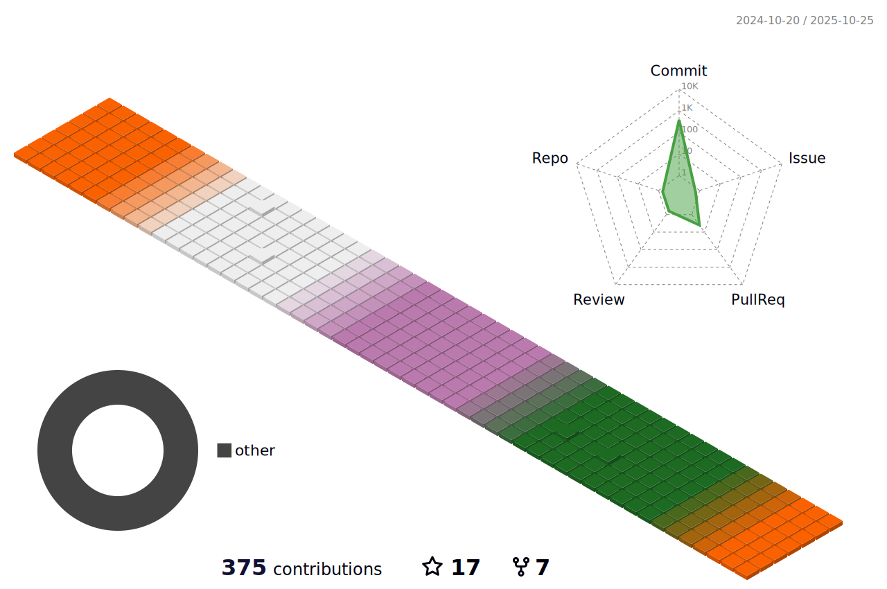

<!--   
    -->
  <samp>Hi, I'm Hung, Frontend developer from Hanoi, Vietnam.</samp>

  <samp>
    learning .
    <a href="https://hung.thedev.id">me</a> .
    <a href="https://web-totals.vercel.app/blog">blog</a> .
    <a href="https://hunghg-resume.vercel.app/">resume</a> .
    <a href="https://toolsfe.vercel.app/tools/index.html">projects</a> .
    <a href="https://twitter.com/hunghg255">tweets</a> .
    <a href="https://hunghg-contact.vercel.app/">contacts</a>
     
    <a href="mailto:giahung197bg@gmail.com">mail</a> .
    <a href="https://gist.github.com/hunghg255">gist</a> .
    <a href="https://github.com/hunghg255/use">use</a>
  </samp>

<!--  
   -->
  
  <h2 align='center'> 📈 Contributions in this year </h2>
<!--    -->
  
  

